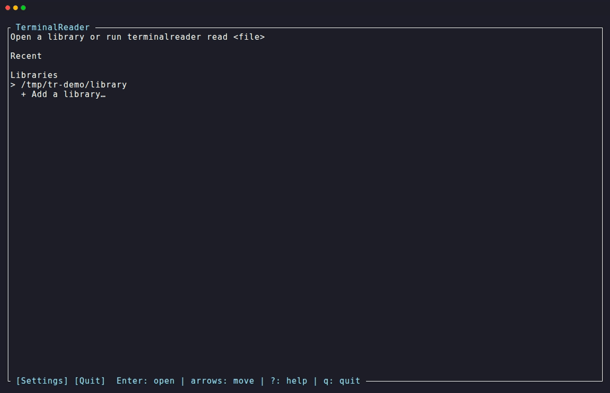
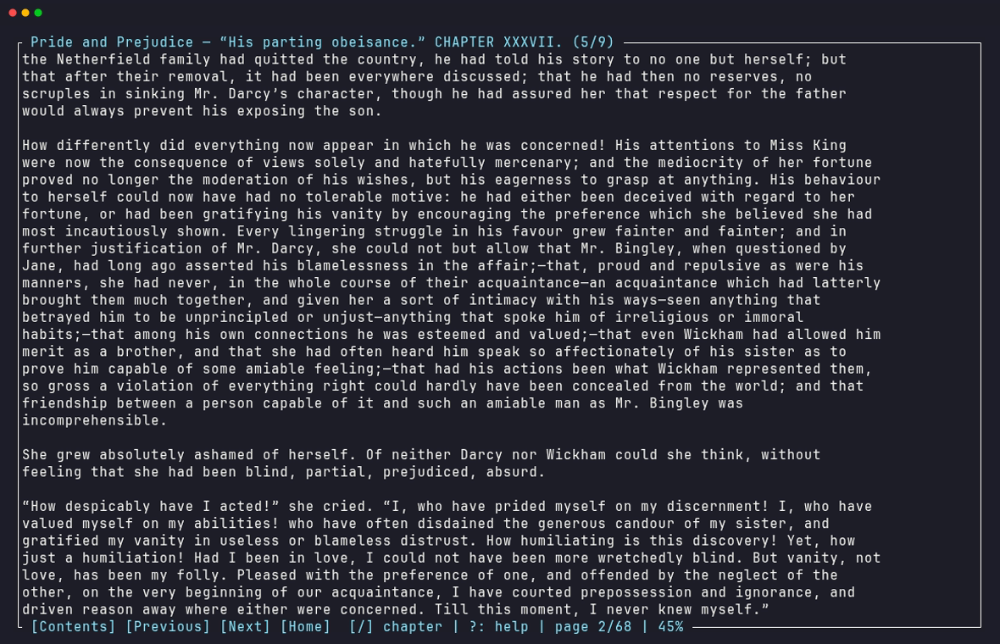
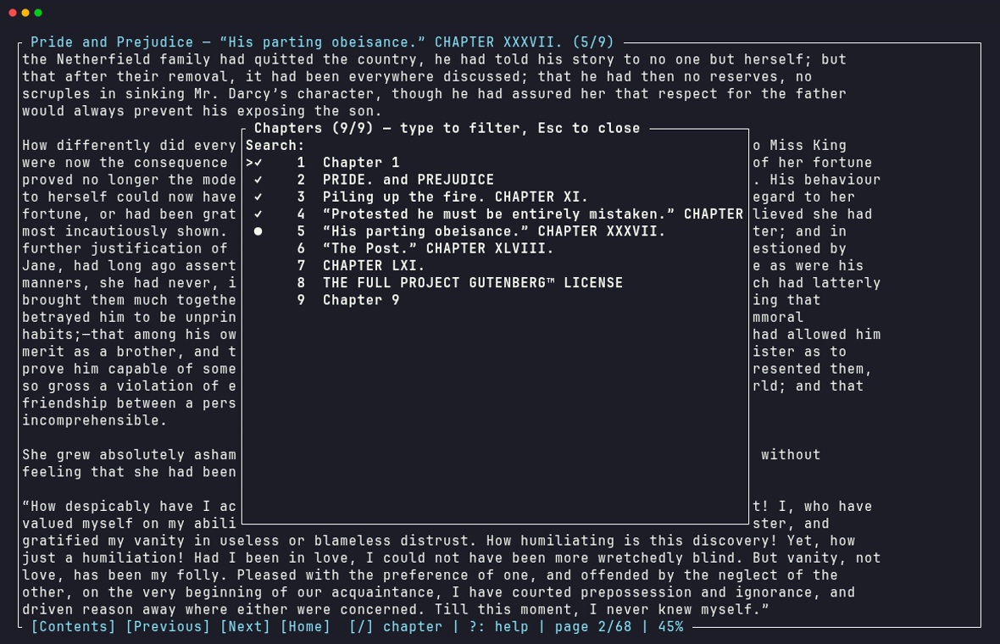
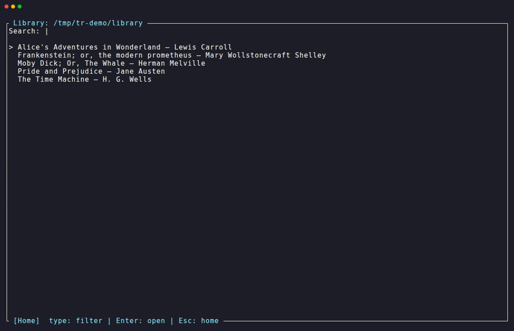
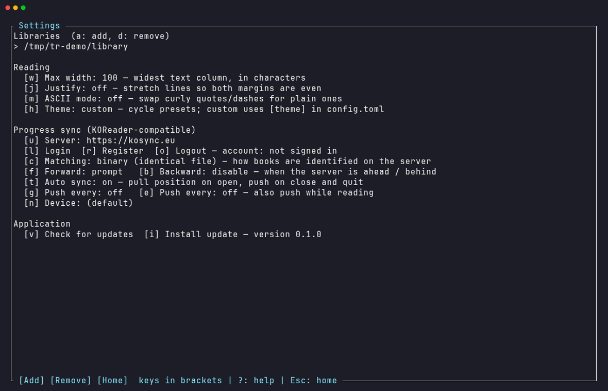

<div align="center">

# 📖 TerminalReader

**A fullscreen EPUB reader for your terminal, with KOReader-compatible progress sync.**

[](https://github.com/Kardzhilov/TerminalReader/actions/workflows/ci.yml)
[](https://github.com/Kardzhilov/TerminalReader/releases/latest)
[](LICENSE)
[](rust-toolchain.toml)

Read your books where you live: the terminal. Keep your place in sync with your
Kobo, Kindle, or any [KOReader](https://koreader.rocks/) device through
[kosync.eu](https://kosync.eu), the official KOReader server, or your own.



</div>

---

## Screenshots

|                     Reading *Pride and Prejudice*                      |                    Table of contents                     |
| :--------------------------------------------------------------------: | :------------------------------------------------------: |
|                              |        |
|                            **Your library**                             |                       **Settings**                        |
|                            |            |

<sub>Screenshots show public-domain books from
[Project Gutenberg](https://www.gutenberg.org/).</sub>

## Highlights

📚 **A proper reading experience** — clean typography with configurable column
width, full justification, and an ASCII-only mode; positions stay anchored to
the word you were reading across any terminal resize.

🔄 **KOReader progress sync** — the full kosync protocol: binary (partial-MD5)
and filename document matching, xpointer ↔ position mapping with percentage
fallback, automatic pull on open with prompt/silent/disabled strategies in each
direction, push on close and per-page-interval, a 25-second debounce, visible
sync status, and a persistent offline queue that drains when you're back online.

🔐 **Credentials done right** — only the derived userkey is stored, in your OS
keyring (Secret Service / Keychain / Credential Manager). Never on disk, and
redacted from logs.

🖱️ **Keyboard first, mouse complete** — every menu is fully clickable with
hover highlighting, while the reading surface itself stays distraction-free.

⚡ **Fast libraries** — recursive scanning with a metadata cache keyed by
path/size/mtime; big collections open instantly after the first scan.

🛠️ **Batteries included** — first-run wizard, help overlay (`?`), `NO_COLOR`
support, self-update (`terminalreader update`), a `doctor` command that checks
everything from config to live server auth, and optional logging with secret
redaction.

## Installation

**Linux / macOS** — installs the latest release to `~/.local/bin`
(override with `TR_INSTALL_DIR`):

```sh
curl -fsSL https://raw.githubusercontent.com/Kardzhilov/TerminalReader/main/install.sh | sh
```

**Windows (PowerShell)** — installs to `%LOCALAPPDATA%\Programs\TerminalReader`
and adds it to your user `PATH`:

```powershell
irm https://raw.githubusercontent.com/Kardzhilov/TerminalReader/main/install.ps1 | iex
```

**From source** (Rust 1.85+; on Linux install `libdbus-1-dev` and `pkg-config`
first):

```sh
cargo install --path crates/tr-tui
```

Prefer manual installs? Grab an archive for Linux (x86_64/aarch64), macOS
(x86_64/aarch64), or Windows from the
[latest release](https://github.com/Kardzhilov/TerminalReader/releases/latest).
Releases are cut automatically on every push to `main`; a commit mentioning
`MAJOR` or `MINOR` bumps that component, anything else is a patch.

## Usage

```sh
terminalreader                 # home screen (first run opens the setup wizard)
terminalreader read book.epub  # open a book directly
terminalreader library DIR     # list EPUBs under DIR
terminalreader addLibrary DIR  # persist a library directory
terminalreader hash book.epub  # print KOReader-compatible document hashes
terminalreader doctor [book]   # verify config, state, keyring, and sync server
terminalreader update          # self-update (--check to only check)
```

### Keys

| Context  | Key                 | Action                                    |
| -------- | ------------------- | ----------------------------------------- |
| Anywhere | `?` / `F1`          | Help overlay                              |
| Home     | `Enter` / `s` / `q` | Open selection / settings / quit          |
| Reader   | `Space` `PgDn` `→`  | Next page                                 |
| Reader   | `PgUp` `←`          | Previous page                             |
| Reader   | `[` / `]`           | Previous / next chapter                   |
| Reader   | `t`                 | Table of contents (type to filter)        |
| Reader   | `/` then `n` / `N`  | Search the book, next / previous match    |
| Reader   | `m` / `M`           | Add a bookmark / open bookmarks           |
| Reader   | `s` / `p`           | Push / pull sync progress now             |
| Reader   | `x`                 | Toggle sync for this book                 |
| Reader   | `Esc` / `q`         | Save position and go home / quit          |

Reader keys are remappable in the `[keys]` section of `config.toml`.
Everything is also mouse-clickable, with hover highlighting; in the reader the
mouse only operates the bottom bar and image boxes, never the page.

## Progress sync

Open Settings (`s`), then:

1. `u` — set the server (default: `https://kosync.eu`)
2. `l` to log in, or `r` to register a new account
3. `c` — pick the document matching method; **binary** (the KOReader default)
   syncs identical files, **filename** syncs by name. This must match your
   other devices.

### Sync settings

| Key | Setting        | What it does                                                                 |
| --- | -------------- | ---------------------------------------------------------------------------- |
| `c` | Matching       | How books are identified on the server: binary (identical file) or filename  |
| `f` | Forward sync   | When the server is *ahead* of you: prompt, silently jump, or ignore          |
| `b` | Backward sync  | When the server is *behind* you: prompt, silently jump, or ignore            |
| `t` | Auto sync      | Pull position on open, push on close and quit                                |
| `g` | Push every N pages | Also push mid-session after every N page turns                           |
| `e` | Push every N minutes | Also push mid-session on a timer                                        |
| `n` | Device name    | The name other devices see in pull prompts                                   |

Automatic pushes are debounced (25 s) and coalesced per book. Failed pushes
are queued on disk and retried automatically — even across restarts. Press
`x` in the reader to exclude a single book from sync, or start with
`--offline` to disable all syncing for a run.

## Theming

Press `h` in Settings to cycle through preset colorways: gruvbox,
gruvbox-light, dracula, nord, solarized, solarized-light, catppuccin,
tokyo-night, and one-dark. The `custom` preset uses the `[theme]` section of
`config.toml` instead:

```toml
[theme]
preset = "custom"  # or any preset name above
accent = "green"   # cyan, blue, green, magenta, red, yellow, white, or gray
light = true       # adjust secondary colors for light terminal backgrounds
```

Set the `NO_COLOR` environment variable to disable colors entirely.

## Configuration

| What                                      | Where (Linux)                            |
| ----------------------------------------- | ---------------------------------------- |
| Config (TOML: library, reading, sync)     | `~/.config/terminalreader/config.toml`   |
| State (positions, recents, cache, queue)  | `~/.local/state/terminalreader/`         |
| Credentials (userkey only)                | OS keyring                               |
| Logs (opt-in via `--log-file`/config)     | wherever you point them                  |

macOS and Windows use the equivalent platform directories.

## Development

```sh
cargo test --workspace                                   # unit tests
cargo clippy --workspace --all-targets -- -D warnings    # lints (pedantic)
cargo +nightly fuzz run epub_open                        # fuzz the EPUB parser
cargo +nightly fuzz run chapter_parse                    # fuzz the chapter XHTML parser
cargo +nightly fuzz run xpointer_parse                   # fuzz progress strings
```

Live server round-trip tests (opt-in, never run in CI):

```sh
TR_SYNC_TEST_SERVER=https://kosync.eu \
TR_SYNC_TEST_USER=user TR_SYNC_TEST_PASSWORD=pass \
cargo test -p tr-kosync --test live -- --ignored
```

Regenerate the README screenshots (uses [vhs](https://github.com/charmbracelet/vhs)
and public-domain EPUBs):

```sh
cargo build --release -p terminalreader
sh docs/make-demo-library.sh
vhs docs/demo.tape
```

<details>
<summary><b>Manual verification checklist (Linux/macOS)</b></summary>

- [ ] First run shows the wizard; Enter adds the directory, Esc skips, and the
      wizard does not reappear on the next start
- [ ] Library scan is fast on the second open (scan cache hit); touching an
      EPUB (`touch book.epub`) rescans only that file
- [ ] Reading preferences: max width caps the column, `j` justifies, `m`
      switches rules/image boxes to ASCII; all persist across restarts
- [ ] Resize the terminal while reading: the top-of-screen word stays anchored,
      below 60×16 the resize notice appears and recovery is clean
- [ ] `NO_COLOR=1 terminalreader` renders without color
- [ ] `?`/`F1` shows the help overlay on every screen; any key closes it
- [ ] `--log-file` writes logs and never contains the userkey/password
- [ ] Doctor reports config, libraries, keyring, queue, and server auth

</details>

<details>
<summary><b>Sync interoperability checklist (real server + KOReader device)</b></summary>

- [ ] Register + login against kosync.eu (or self-hosted) from Settings
- [ ] `terminalreader hash book.epub` matches the document id shown by the
      server dashboard / KOReader for the identical file
- [ ] Read on a KOReader device, push, then open the same book here: the pull
      prompt appears with the device name and jumps to the right paragraph
- [ ] Read here, quit, then open on the KOReader device: KOReader offers the
      forward position
- [ ] Disable networking, turn pages, quit: queue persists; next start with
      network, the queue drains (doctor shows 0 pending)

</details>

## Acknowledgements

- [KOReader](https://koreader.rocks/) for the sync protocol and inspiration
- [kosync.eu](https://kosync.eu) for the free community sync server
- [Project Gutenberg](https://www.gutenberg.org/) for the public-domain books
  in the screenshots
- [ratatui](https://ratatui.rs/) for the TUI framework

## License

[AGPL-3.0-or-later](LICENSE)